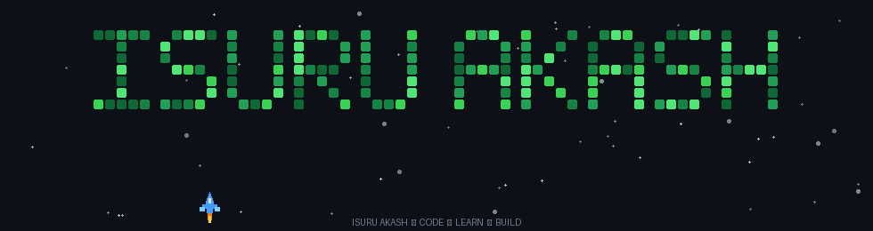

<h1 align="center">
  Hey
  
  I'm Isuru Akash
</h1>

<h3 align="center">
  Software Engineering Undergraduate • Developer • Tech Enthusiast 🚀
</h3>

  

  

---

## 👨‍💻 About Me

- 🎓 Software Engineering undergraduate
- 🇱🇰 Based in Sri Lanka
- 💻 Interested in **Web Development, Backend Development and Software Engineering**
- ⚙️ Interested in building reliable and practical software systems
- 🧠 Interested in **APIs, databases, system design and problem solving**
- 🏗️ Building academic and real-world software projects
- 🌱 Continuously improving my full-stack development skills
- 🚀 Learning new technologies and software engineering practices

---

## 📊 GitHub Analytics

  

  

  

---

# 🛠️ Languages & Tools

<h3 align="center">💻 Programming Languages</h3>

  

  JavaScript &nbsp; • &nbsp; C# &nbsp; • &nbsp; Java

 

<h3 align="center">🎨 Frontend Development</h3>

  

  HTML5 &nbsp; • &nbsp; CSS3 &nbsp; • &nbsp; JavaScript &nbsp; • &nbsp; React

 

<h3 align="center">⚙️ Backend Development</h3>

  

  Node.js &nbsp; • &nbsp; Express.js &nbsp; • &nbsp; ASP.NET Core

 

<h3 align="center">🗄️ Database Technologies</h3>

  
  &nbsp;&nbsp;
  

  MySQL &nbsp; • &nbsp; Microsoft SQL Server

 

<h3 align="center">🔧 Development Tools</h3>

  

  Git &nbsp; • &nbsp; GitHub &nbsp; • &nbsp; VS Code &nbsp; • &nbsp; Visual Studio &nbsp; • &nbsp; Figma

---

## 💻 Most Used Languages

  

---

# 🚀 Featured Projects

## 🏗️ SiteVision

### Construction Management System

A web-based construction management platform designed to improve communication, project coordination and workflow between **clients, construction companies, suppliers and supervisors**.

**Technologies**

  
  
  
  
  

---

## 🎫 KMC Event Platform

### Event Management & Ticket Booking System

A service-oriented event platform designed for **event publishing, participant registration, ticket booking, payments and external organizer integration**.

**Technologies**

  
  
  
  
  

---

## 🌐 Personal Portfolio

### Developer Portfolio Website

A personal portfolio website created to showcase my **technical skills, education, projects and software development journey**.

**Technologies**

  
  
  

---

# 🌱 Currently Learning

  

  

  

  

 

  

  

  

---

# 🔗 Connect With Me

  

  &nbsp;&nbsp;

  

  

---

# 🎮 Contribution Space

  

---

<h3 align="center">
  💻 Code • Learn • Build • Improve 🚀
</h3>

  <i>
    Turning ideas into practical software, one project at a time.
  </i>

  ⭐ Thanks for visiting my profile!

